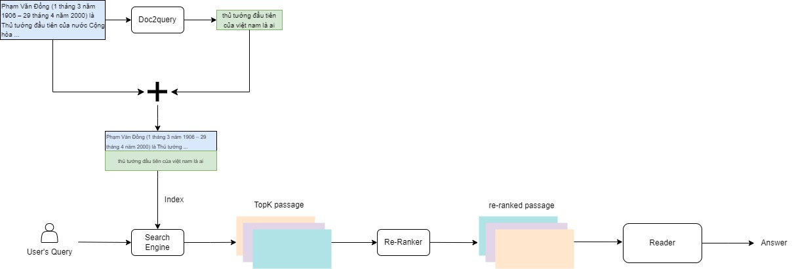
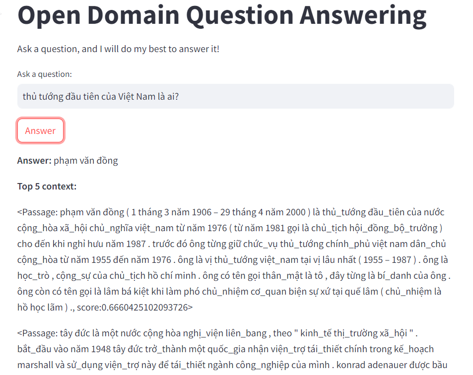

# Vietnamese Open Domain Question Answering

## Overview Pipeline


## Package Installation

```
conda create -n odqa python==3.8
conda activate odqa
conda install -c conda-forge openjdk=11
pip install transformers==4.28.1
pip install pyserini
pip install pyvi
```

## 1. Build Index by Pyserini
 - ```Pyserini.ipynb```
 or you can download the prepared index here [link](https://drive.google.com/file/d/1bwyzBdfUDKBmjEWEr29SFdtHWYDz90Zc/view?usp=sharing).
 It contains the indexed UIT-ViQuAD dump with Anserini.

## 2. Train model Ranking
 - ```TrainRanker.ipynb``` or you can download the trained model herer [link](https://drive.google.com/file/d/1a6YzQg--UcH4ZCkZE01rYaYHVaYYr7h8/view?usp=sharing)
## 3. Inference & Evaluate E2E

- ```Inference.ipynb```

Expected results:

```
## XLM-Roberta_Large
{'exact_match': 52.67, 'f1': 60.26, 'recall': 59.98,'precision': 67.54}
'''
## XLM-Roberta_Base:
{'exact_match': 35.75, 'f1': 45.54, 'recall': 45.52, 'precision': 49.05}
```
## 4. Run Demo

```uvicorn backend:app --port 8088```

```streamlit run demo_app.py --server.port 8087```

